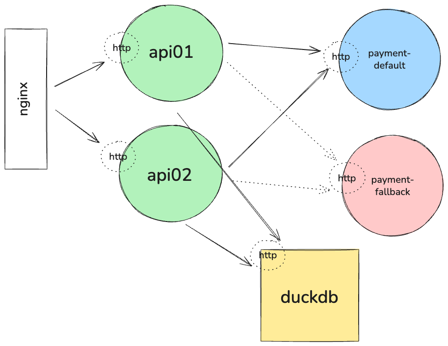

# Rinha de Backend 2025 - ricardovhz

Minha contribuição para o Rinha de Backend, temporada 2025.

## Linguagem

Go

## Arquitetura



## Resultados obtidos

```
     balance_inconsistency_amount...: 0         0/s
     data_received..................: 1.8 MB    30 kB/s
     data_sent......................: 3.0 MB    49 kB/s
     default_total_amount...........: 172990.7  2828.455985/s
     default_total_fee..............: 8649.535  141.422799/s
     default_total_requests.........: 8693      142.133467/s
     fallback_total_amount..........: 66764.5   1091.621975/s
     fallback_total_fee.............: 10014.675 163.743296/s
     fallback_total_requests........: 3355      54.855376/s
     http_req_blocked...............: p(99)=467.29µs count=15033
     http_req_connecting............: p(99)=317.23µs count=15033
     http_req_duration..............: p(99)=93.01ms  count=15033
       { expected_response:true }...: p(99)=93.01ms  count=15032
     http_req_failed................: 0.00%     ✓ 1           ✗ 15032
     http_req_receiving.............: p(99)=450.69µs count=15033
     http_req_sending...............: p(99)=143.53µs count=15033
     http_req_tls_handshaking.......: p(99)=0s       count=15033
     http_req_waiting...............: p(99)=92.92ms  count=15033
     http_reqs......................: 15033     245.794594/s
     iteration_duration.............: p(99)=1.09s    count=14995
     iterations.....................: 14995     245.173281/s
     total_transactions_amount......: 239755.2  3920.07796/s
     transactions_failure...........: 0         0/s
     transactions_success...........: 14983     244.977077/s
     vus............................: 186       min=7         max=498
```